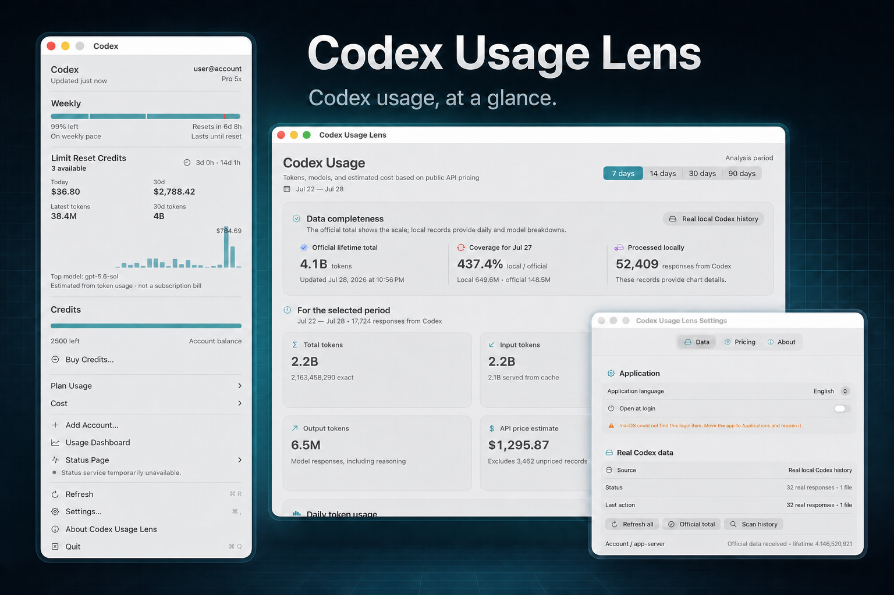

# Codex Usage Lens

Codex Usage Lens is a native, local-first macOS menu bar app for inspecting
Codex token usage and estimating its **API-equivalent** cost in USD.

> API-equivalent is an estimate based on public API prices. It is not billing,
> an actual charge, or the price of a Codex subscription.

Current version: **1.3 (build 7)**.

[](https://github.com/fokkeua/Codex-Usage-Lens/releases/latest/download/CodexUsageLens-app-arm64.zip)

## Install on Apple Silicon

1. Download the latest
   [`CodexUsageLens-app-arm64.zip`](https://github.com/fokkeua/Codex-Usage-Lens/releases/latest/download/CodexUsageLens-app-arm64.zip).
2. Unzip the archive and move **Codex Usage Lens.app** to **Applications**.
3. Control-click the app, choose **Open**, then confirm **Open**.
4. If macOS still blocks the app, open **System Settings → Privacy &
   Security**, scroll to the security message, and choose **Open Anyway**.

The release is ad-hoc signed and is intentionally not notarized by Apple, so
the first-launch Gatekeeper warning is expected. After launch, the chart icon
appears in the macOS menu bar.

You can verify the download against
[`SHA256SUMS`](https://github.com/fokkeua/Codex-Usage-Lens/releases/latest/download/SHA256SUMS):

```bash
shasum -a 256 ~/Downloads/CodexUsageLens-app-arm64.zip
```

[View all releases](https://github.com/fokkeua/Codex-Usage-Lens/releases).

## Screenshots



## Features

- today and current-week totals in the menu bar;
- charts and tables grouped by day and model;
- input, cached input, cache-write, output, and reasoning tokens when available;
- official account lifetime and daily usage for comparison;
- local-detail coverage and reconciliation;
- editable API-equivalent pricing rules;
- explicit reporting of records whose model has no public price.

## Requirements

- an Apple Silicon Mac;
- macOS 14 or newer;
- Codex installed and authenticated for official account usage.

The project has no third-party Swift package dependencies.

## Build from source

Building from source additionally requires Xcode Command Line Tools or Xcode
with Swift 6.

```bash
# After cloning the repository:
cd codex-usage-lens
zsh scripts/run-app.sh
```

The chart icon appears in the macOS menu bar. The built app is written to:

```text
build/Codex Usage Lens.app
```

Run the test suite:

```bash
CLANG_MODULE_CACHE_PATH="$PWD/.build/ModuleCache" \
SWIFTPM_MODULECACHE_OVERRIDE="$PWD/.build/ModuleCache" \
swift test --disable-sandbox
```

Build the app directly:

```bash
zsh scripts/build-app.sh release
```

For an ad-hoc signed local QA archive:

```bash
ALLOW_UNNOTARIZED_RELEASE=1 zsh scripts/package-release.sh
```

Pushing a matching version tag such as `v1.3.0` runs the release workflow and
publishes the Apple Silicon ZIP, source ZIP, and checksums automatically. See
[Releasing](docs/RELEASING.md) for the maintainer checklist.

## Launch at login

Enable **Settings → Data → Application → Open at login** to keep Codex Usage
Lens available in the menu bar after signing in to the Mac. The app uses the
native macOS Login Items service and links directly to System Settings if
approval is required.

This is also the recommended way to have the lens ready whenever Codex opens.
macOS does not provide an unrelated app with a launch hook for Codex unless a
separate helper is already running, so the app does not install a permanent
Codex watcher.

## Data sources

The app combines three sources:

1. `codex app-server --stdio` with `account/usage/read` for official account
   totals and daily buckets. The app uses the stable app-server surface and
   does not enable `experimentalApi`.
2. An authenticated JSON OTel receiver on `127.0.0.1:4319/v1/logs` for live
   per-response detail.
3. A streaming parser for `~/.codex/sessions/**/*.jsonl` to backfill historical
   model and token-type detail. This on-disk format is treated as experimental.

The app-server uses the existing Codex authentication itself. Codex Usage Lens
does not read `auth.json`. The session parser extracts model/settings metadata
and `token_count`; it does not deserialize message text, reasoning text, tool
payloads, or credentials.

See [Data sources](docs/DATA_SOURCES.md) for limits, reconciliation rules, and
format details.

## Live OTel setup

In **Settings → Data**, choose **Add secure OTel configuration…** and confirm
the change. The app creates a private random capability and adds a configuration
only when an `[otel]` section is not already present:

```toml
[otel]
environment = "codex-usage-lens"
log_user_prompt = false
exporter = { otlp-http = { endpoint = "http://127.0.0.1:4319/v1/logs", protocol = "json", headers = { "x-codex-usage-lens-token" = "<generated capability>" } } }
```

Do not copy the placeholder manually. The app inserts the real value. Restart
Codex completely after the configuration changes.

The receiver accepts strict authenticated `POST /v1/logs` requests only on the
loopback interface. It limits request size and concurrent connections and
acknowledges a batch only after durable local persistence.

## Privacy and security

All state stays on the Mac:

```text
~/Library/Application Support/CodexUsageMenuBar/state.json
~/Library/Application Support/CodexUsageMenuBar/otel-capability
```

The directory uses mode `0700`; files use `0600`. Raw thread IDs and source
event IDs are not persisted. Network access is limited to the local Codex
app-server and official OpenAI pricing pages.

Imports, session scanning, app-server responses, OTel input, and persisted
state are bounded and reject symbolic links or unexpected special files where
applicable. The test suite includes security-hardening coverage for file races,
input limits, redirect validation, and durable writes.

Read [Privacy](docs/PRIVACY.md) for the complete data-handling summary and
[Security policy](SECURITY.md) for vulnerability reporting.

## Repository layout

```text
Sources/CodexUsageMenuBar/
  CodexAppServerClient.swift    # account/usage/read + model/list
  CodexLocalSessionSource.swift # experimental historical backfill
  OTelLiveReceiver.swift        # loopback OTLP/HTTP JSON
  UsageStore.swift              # synchronization and local persistence
  Pricing.swift                 # official price refresh and estimates
  MenuBarView.swift
  DashboardView.swift
  SettingsView.swift

Tests/CodexUsageMenuBarTests/   # unit, integration, QA, and hardening tests
Packaging/                      # Info.plist and app icon catalog
scripts/                        # build, QA, audit, and release scripts
```

## Contributing

Contributions are welcome. Read [CONTRIBUTING.md](CONTRIBUTING.md) before
opening a pull request. For usage questions, see [SUPPORT.md](SUPPORT.md).
Security issues must follow [SECURITY.md](SECURITY.md), not public issues.

## License and trademarks

Licensed under the [MIT License](LICENSE).

Codex and OpenAI are trademarks of their respective owners. This independent
community project is not affiliated with or endorsed by OpenAI.
