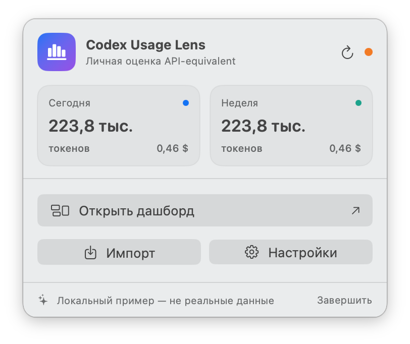
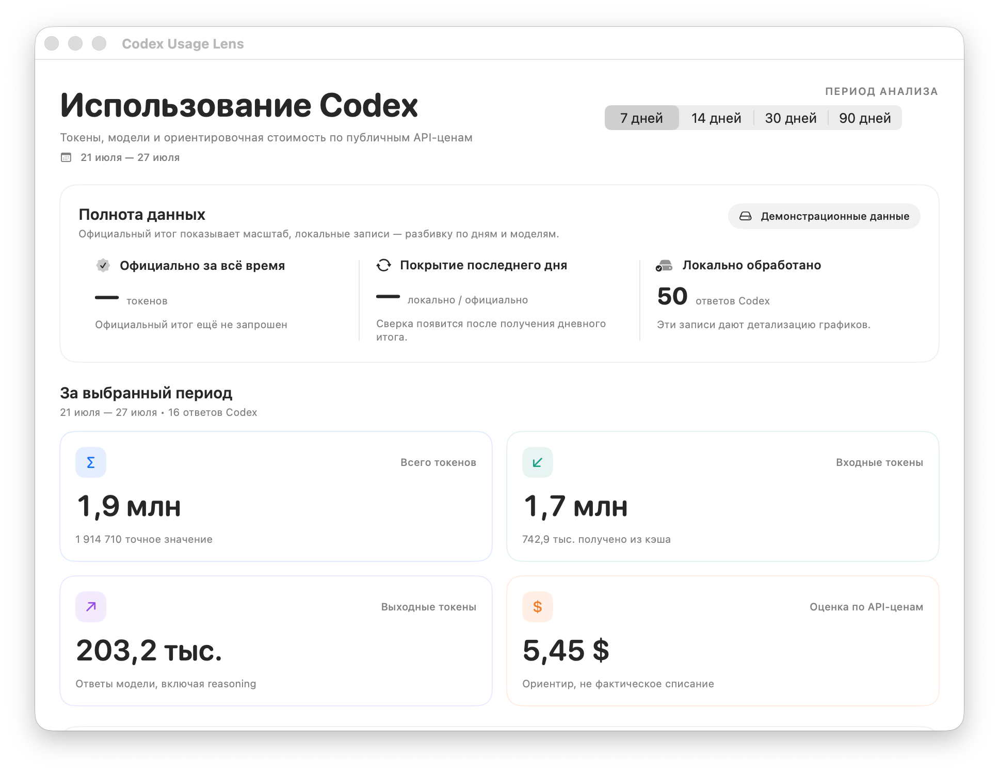

# Codex Usage Lens

[English](README.md) · [Українська](README.uk.md)

Нативное локальное macOS-приложение в строке меню для просмотра реального
usage Codex и оценки его **API-equivalent** в USD.

API-equivalent — ориентировочная стоимость тех же токенов по публичным
API-ценам. Это не биллинг, не фактическое списание и не стоимость подписки.

Текущая версия: **1.2 (build 6)**.

## Скриншоты

### Основной интерфейс



### Дашборд



## Быстрый запуск

Требования: macOS 14+, Xcode Command Line Tools / Xcode со Swift 6.

```bash
cd "/path/to/Codex Usage Menu"
zsh scripts/run-app.sh
```

Значок графика появится справа в верхней панели macOS. Сборка:

```text
build/Codex Usage Lens.app
```

Тесты и отдельная сборка:

```bash
CLANG_MODULE_CACHE_PATH="$PWD/.build/ModuleCache" \
SWIFTPM_MODULECACHE_OVERRIDE="$PWD/.build/ModuleCache" \
swift test --disable-sandbox

zsh scripts/build-app.sh release

# Локальный QA-пакет с ad-hoc подписью:
ALLOW_UNNOTARIZED_RELEASE=1 zsh scripts/package-release.sh

# Дистрибутив: Developer ID + обязательная notarization:
CODE_SIGN_IDENTITY="Developer ID Application: …" \
NOTARY_PROFILE="codex-usage-lens" \
zsh scripts/package-release.sh
```

Release-сборка удаляет только локальные symbol-table записи из пользовательского
бинарника; matching dSYM остаётся в `.build`, поэтому диагностика crash-логов
не теряется.

## Автозапуск

Включите **«Настройки → Данные → Приложение → Открывать при входе в macOS»**,
чтобы Codex Usage Lens появлялся в строке меню после входа в учётную запись.
Приложение использует штатный механизм «Объекты входа» и при необходимости
открывает соответствующий раздел системных настроек.

Это также рекомендуемый вариант для совместной работы с Codex: к моменту
запуска Codex линза уже работает. macOS не предоставляет стороннему приложению
событие запуска Codex без отдельного постоянно работающего helper-процесса,
поэтому приложение не устанавливает такой watcher.

## Что показывает приложение

- сегодня и текущую неделю в menu bar;
- график и таблицу по дням и моделям;
- input, cached input, cache write, output и reasoning при наличии;
- официальный lifetime/day usage для сверки;
- процент покрытия локальной детализацией;
- API-equivalent по настраиваемой таблице;
- количество записей моделей без публичной цены.

## Как получаются реальные данные

Приложение объединяет три слоя:

1. `codex app-server --stdio` + `account/usage/read` — документированный
   официальный account total и дневные bucket. Приложение использует только
   стабильную поверхность app-server и не включает `experimentalApi`.
2. Встроенный JSON OTel receiver на `127.0.0.1:4319/v1/logs` —
   поддерживаемая live-детализация будущих ответов.
3. Потоковый разбор `~/.codex/sessions/**/*.jsonl` — историческая разбивка
   по моделям и типам токенов; этот формат помечен как experimental.

App-server использует текущую авторизацию Codex самостоятельно. Приложение не
читает `auth.json`. Rollout parser десериализует только model/settings и
`token_count`; тексты сообщений и tool payloads пропускаются до JSON parsing.

Первый полный scan большой истории может занять время. После него приложение
использует incremental watermark и читает только изменившиеся rollout-файлы.

Дашборд строит единый кэшируемый аналитический snapshot, а сохранение большого
state коалесцируется и выполняется на отдельной serial queue. Поэтому закрытые
окна не продолжают пересчитывать Charts, а live-события не запускают повторные
полные сортировки всей истории.

Импорт JSONL/NDJSON также выполняется потоково: файл читается блоками, поэтому
его полный размер не дублируется в оперативной памяти. До создания Foundation
object graph каждый JSON-документ проходит линейный structural preflight:
принимается только UTF-8 без BOM, каждый массив ограничен 100 000 элементами,
каждый объект — 256 полями, а общий бюджет одного JSON-дерева —
2 000 001 structural entry. Те же правила применяются к каждой строке
JSONL/NDJSON и к распознаваемому embedded JSON в полях OTel `body`.

Импорт, rollout scan, app-server и OTel receiver также имеют лимиты размера,
количества записей и глубины JSON. Символические ссылки и специальные файлы не
принимаются. Локальный state хранится в компактном формате с числовыми
timestamp и совместимо загружает предыдущий ISO-формат.

CSV проходит отдельный двухфазный preflight: поддерживается ровно один
начальный UTF-8 BOM, проверяются CR/LF/CRLF и escaped quotes, а общее число
ячеек ограничено до создания строковых объектов. Token counters и JSON-RPC ID
принимаются только как точные целые значения — boolean, fractional,
non-finite и округляющиеся дробные лексемы отвергаются.

Подробности: [docs/DATA_SOURCES.md](docs/DATA_SOURCES.md).

## Live OTel

В «Настройки → Данные» нажмите «Добавить безопасную OTel-настройку…» и
подтвердите изменение. Приложение создаст приватный случайный capability,
запустит receiver и добавит секцию только если `[otel]` ещё отсутствует:

```toml
[otel]
environment = "codex-usage-lens"
log_user_prompt = false
exporter = { otlp-http = { endpoint = "http://127.0.0.1:4319/v1/logs", protocol = "json", headers = { "x-codex-usage-lens-token" = "<сгенерированный capability>" } } }
```

Не копируйте placeholder вручную: приложение подставляет реальное значение
само. При первом создании оно записывает и синхронизирует приватный временный
inode, затем атомарно публикует готовый capability. Параллельные экземпляры
получают одно полностью записанное значение, а symbolic link вместо файла
отвергается. Receiver принимает только строгие `POST /v1/logs` с этим
заголовком, JSON MIME type и корректным `Host`, не более 2 МиБ на запрос и
16 одновременных соединений. Успешный HTTP 200 отправляется только после
атомарного сохранения batch в `state.json`; временный отказ возвращает 503, а
переполнение state или диска — 507, чтобы exporter мог повторить доставку.
После изменения полностью перезапустите Codex.

Если `[otel]` уже существует, приложение его не перезаписывает. Точный старый
блок Codex Usage Lens без capability также не мигрируется автоматически: UI
просит удалить его вручную и повторить установку. TOML-проверка учитывает
таблицы, dotted keys, inline assignment и escaped quoted keys, поэтому
пользовательская OTel-конфигурация остаётся нетронутой.

## API-equivalent

Приложение обновляет ставки best effort с официальных страниц:

- <https://developers.openai.com/api/docs/models/gpt-5.6-sol>
- <https://developers.openai.com/api/docs/models/gpt-5.6-terra>
- <https://developers.openai.com/api/docs/models/gpt-5.6-luna>

Ставки задаются в USD за миллион токенов. Формула:

```text
uncached = max(0, input - cached - cache_write)

estimate =
  uncached × input_rate
  + cached × cached_rate
  + cache_write × cache_write_rate
  + output × output_rate
```

Также учтены опубликованные правила GPT-5.6:

- input свыше 272K: 2× input и 1.5× output для всего запроса;
- cache write: 1.25× обычного input;
- `fast`/`priority`: сохранённый priority multiplier;
- reasoning входит в output и не прибавляется повторно.

Если официальный HTML изменился, сохраняется предыдущая таблица. Ручные строки
не удаляются. Модели без опубликованной цены (например внутренние slug) остаются
в токенах, но не получают выдуманную стоимость.

При пересекающихся ручных шаблонах выбор детерминирован: точное имя модели
имеет приоритет над wildcard, затем выбирается самый длинный prefix, а `*`
служит только fallback. При одинаковой специфичности побеждает первая строка
таблицы.

## Хранение и приватность

Состояние хранится только локально:

```text
~/Library/Application Support/CodexUsageMenuBar/state.json
~/Library/Application Support/CodexUsageMenuBar/otel-capability
```

Каталог имеет права `0700`, файлы — `0600`. В state не сохраняются raw thread
ID или source event ID; повреждённый state помещается рядом в quarantine и не
подменяется demo-данными.

Один экземпляр удерживает lifetime single-writer lease на каталог состояния.
Следующий экземпляр может прочитать snapshot, но остаётся read-only и явно
сообщает, что сохранение недоступно. Запись `state.json` выполняется
descriptor-relative через приватный временный обычный файл, `fsync`,
атомарный `renameat` и `fsync` каталога; symlink-подмена каталогов, lock-файла
или state не принимается. Создание каталога также проходит каждый компонент
абсолютного пути через `openat`/`mkdirat` с `O_NOFOLLOW`; промежуточный
symbolic link не может увести state, capability или OTel config за ожидаемую
границу.

Размер state ограничен 64 МиБ как при чтении, так и при записи. Bounded decode
останавливает массивы до materialization лишних элементов: не более 100 000
records, 4 096 цен, 100 известных моделей и 10 000 дневных account bucket.
Пустая сохранённая таблица цен остаётся пустой после перезапуска; значения по
умолчанию добавляются только когда `state.json` действительно отсутствует.
Мутация, которая может вывести encoded state за 64 МиБ, сначала кодируется и
атомарно сохраняется как candidate и только затем публикуется в UI; при
ошибке память и диск остаются на предыдущем согласованном состоянии.

Release-скрипт до сборки рекурсивно отклоняет symbolic links, специальные и
hard-linked файлы во включаемом source tree, повторяет проверку staging перед
ZIP и публикует приложение и оба архива транзакционно с rollback.

Сетевые обращения выполняются только к локальному Codex app-server и
официальным страницам OpenAI pricing. OTel listener принимает соединения
только на `127.0.0.1` и требует локальный capability.

## Структура

```text
Sources/CodexUsageMenuBar/
  CodexAppServerClient.swift    # account/usage/read + model/list
  CodexLocalSessionSource.swift # experimental historical backfill
  OTelLiveReceiver.swift        # loopback OTLP/HTTP JSON
  UsageStore.swift              # sync, reconciliation, persistence
  Pricing.swift                 # official page refresh + API-equivalent
  MenuBarView.swift
  DashboardView.swift
  SettingsView.swift
```

## Участие и лицензия

Перед отправкой изменений прочитайте [CONTRIBUTING.md](CONTRIBUTING.md).
Уязвимости следует сообщать по правилам из [SECURITY.md](SECURITY.md), а не
через публичные issue.

Проект распространяется по лицензии [MIT](LICENSE). Codex и OpenAI являются
товарными знаками их соответствующих владельцев. Этот проект является
независимым community-проектом и не аффилирован с OpenAI.
