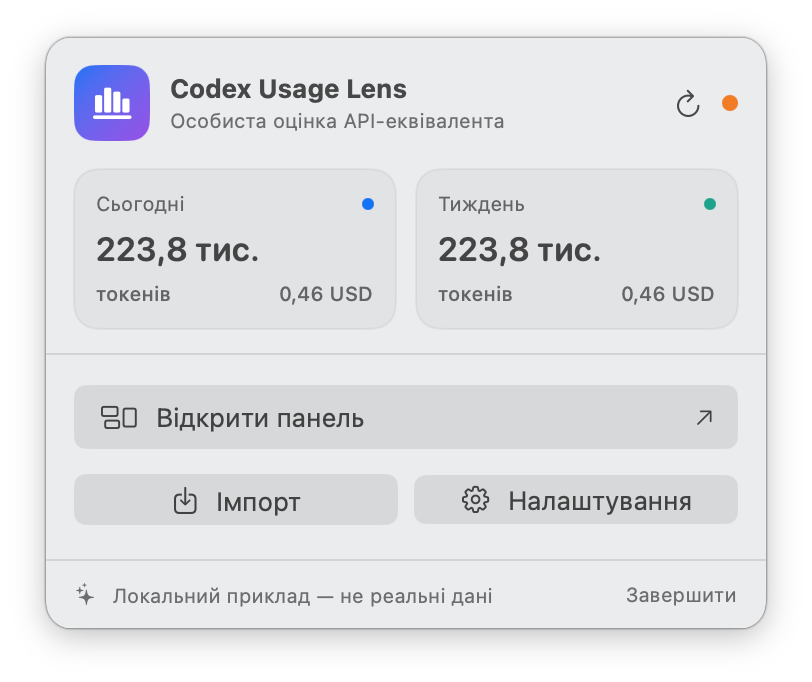
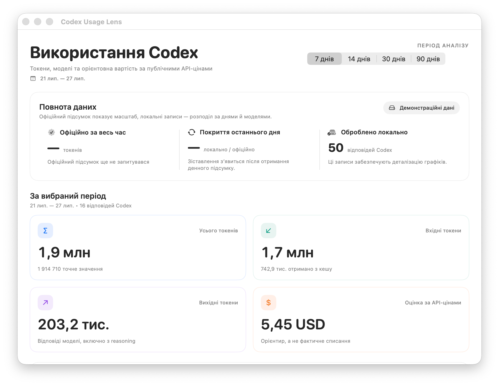

# Codex Usage Lens

[English](README.md) · [Русская версия](README.ru.md)

Нативний локальний застосунок macOS у рядку меню для перегляду реального
використання Codex та оцінювання його **API-equivalent** у USD.

API-equivalent — це орієнтовна вартість такого самого обсягу токенів за
публічними API-цінами. Це не білінг, не фактичне списання і не вартість
підписки.

Поточна версія: **1.2 (build 6)**.

## Знімки екрана

### Основний інтерфейс



### Панель



## Швидкий запуск

Вимоги: macOS 14+, Xcode Command Line Tools або Xcode зі Swift 6.

```bash
cd "/path/to/Codex Usage Menu"
zsh scripts/run-app.sh
```

Піктограма графіка з’явиться праворуч у верхній панелі macOS. Зібраний
застосунок:

```text
build/Codex Usage Lens.app
```

Тести та окрема збірка:

```bash
CLANG_MODULE_CACHE_PATH="$PWD/.build/ModuleCache" \
SWIFTPM_MODULECACHE_OVERRIDE="$PWD/.build/ModuleCache" \
swift test --disable-sandbox

zsh scripts/build-app.sh release

# Локальний QA-пакет з ad-hoc підписом:
ALLOW_UNNOTARIZED_RELEASE=1 zsh scripts/package-release.sh

# Дистрибутив: Developer ID + обов’язкова notarization:
CODE_SIGN_IDENTITY="Developer ID Application: …" \
NOTARY_PROFILE="codex-usage-lens" \
zsh scripts/package-release.sh
```

Release-збірка видаляє лише локальні symbol-table записи з користувацького
бінарного файла; відповідний dSYM залишається в `.build`, тому діагностика
crash-логів не втрачається.

## Що показує застосунок

- сьогоднішні показники та поточний тиждень у menu bar;
- графік і таблицю за днями та моделями;
- input, cached input, cache write, output і reasoning за наявності;
- офіційне lifetime/day використання для зіставлення;
- відсоток покриття локальною деталізацією;
- API-equivalent за налаштовуваною таблицею;
- кількість записів моделей без публічної ціни.

## Як отримуються реальні дані

Застосунок об’єднує три шари:

1. `codex app-server --stdio` + `account/usage/read` — документований
   офіційний account total і денні bucket. Застосунок використовує лише
   стабільну поверхню app-server і не вмикає `experimentalApi`.
2. Вбудований JSON OTel receiver на `127.0.0.1:4319/v1/logs` —
   підтримувана live-деталізація майбутніх відповідей.
3. Потокове читання `~/.codex/sessions/**/*.jsonl` — історична розбивка за
   моделями й типами токенів; цей формат позначено як experimental.

App-server самостійно використовує поточну авторизацію Codex. Застосунок не
читає `auth.json`. Rollout parser десеріалізує лише model/settings і
`token_count`; тексти повідомлень та tool payloads відкидаються ще до JSON
parsing.

Перше повне сканування великої історії може тривати певний час. Після нього
застосунок використовує incremental watermark і читає лише змінені
rollout-файли.

Панель будує єдиний кешований аналітичний snapshot, а збереження великого
state об’єднується та виконується в окремій serial queue. Тому закриті вікна
не продовжують перераховувати Charts, а live-події не запускають повторне
повне сортування всієї історії.

Імпорт JSONL/NDJSON також виконується потоково: файл читається блоками, тому
його повний розмір не дублюється в оперативній пам’яті. До створення
Foundation object graph кожен JSON-документ проходить лінійний structural
preflight: приймається лише UTF-8 без BOM, кожен масив обмежено 100 000
елементами, кожен об’єкт — 256 полями, а загальний бюджет одного JSON-дерева —
2 000 001 structural entry. Ті самі правила застосовуються до кожного рядка
JSONL/NDJSON і до розпізнаного embedded JSON у полях OTel `body`.

Імпорт, rollout scan, app-server і OTel receiver також мають обмеження
розміру, кількості записів та глибини JSON. Символьні посилання й спеціальні
файли не приймаються. Локальний state зберігається в компактному форматі з
числовими timestamp і сумісно завантажує попередній ISO-формат.

CSV проходить окремий двофазний preflight: підтримується рівно один початковий
UTF-8 BOM, перевіряються CR/LF/CRLF та escaped quotes, а загальна кількість
комірок обмежується до створення рядкових об’єктів. Token counters і JSON-RPC
ID приймаються лише як точні цілі значення — boolean, fractional, non-finite
та дробові лексеми, що потребують округлення, відхиляються.

Докладніше: [docs/DATA_SOURCES.md](docs/DATA_SOURCES.md).

## Live OTel

У «Налаштування → Дані» натисніть «Додати безпечне OTel-налаштування…» і
підтвердьте зміну. Застосунок створить приватний випадковий capability,
запустить receiver і додасть секцію, лише якщо `[otel]` ще немає:

```toml
[otel]
environment = "codex-usage-lens"
log_user_prompt = false
exporter = { otlp-http = { endpoint = "http://127.0.0.1:4319/v1/logs", protocol = "json", headers = { "x-codex-usage-lens-token" = "<згенерований capability>" } } }
```

Не копіюйте placeholder вручну: застосунок сам підставляє справжнє значення.
Під час першого створення він записує та синхронізує приватний тимчасовий
inode, а потім атомарно публікує готовий capability. Паралельні екземпляри
отримують одне повністю записане значення, а symbolic link замість файла
відхиляється. Receiver приймає лише строгі `POST /v1/logs` із цим заголовком,
JSON MIME type і коректним `Host`, не більше 2 МіБ на запит та 16 одночасних
з’єднань. Успішний HTTP 200 надсилається лише після атомарного збереження batch
у `state.json`; тимчасова відмова повертає 503, а переповнення state або диска
— 507, щоб exporter міг повторити доставлення. Після зміни повністю
перезапустіть Codex.

Якщо `[otel]` уже існує, застосунок його не перезаписує. Точний старий блок
Codex Usage Lens без capability також не мігрується автоматично: UI просить
видалити його вручну й повторити встановлення. TOML-перевірка враховує
таблиці, dotted keys, inline assignment та escaped quoted keys, тому
користувацька OTel-конфігурація залишається незмінною.

## API-equivalent

Застосунок best effort оновлює ставки з офіційних сторінок:

- <https://developers.openai.com/api/docs/models/gpt-5.6-sol>
- <https://developers.openai.com/api/docs/models/gpt-5.6-terra>
- <https://developers.openai.com/api/docs/models/gpt-5.6-luna>

Ставки задаються в USD за мільйон токенів. Формула:

```text
uncached = max(0, input - cached - cache_write)

estimate =
  uncached × input_rate
  + cached × cached_rate
  + cache_write × cache_write_rate
  + output × output_rate
```

Також враховано опубліковані правила GPT-5.6:

- input понад 272K: 2× input і 1.5× output для всього запиту;
- cache write: 1.25× звичайного input;
- `fast`/`priority`: збережений priority multiplier;
- reasoning входить до output і не додається повторно.

Якщо офіційний HTML зміниться, зберігається попередня таблиця. Ручні рядки не
видаляються. Моделі без опублікованої ціни, наприклад внутрішні slug,
залишаються в токенах, але не отримують вигаданої вартості.

Для шаблонів, що перетинаються, вибір детермінований: точна назва моделі має
пріоритет над wildcard, потім вибирається найдовший prefix, а `*` слугує лише
fallback. За однакової специфічності перемагає перший рядок таблиці.

## Зберігання і приватність

Стан зберігається лише локально:

```text
~/Library/Application Support/CodexUsageMenuBar/state.json
~/Library/Application Support/CodexUsageMenuBar/otel-capability
```

Каталог має права `0700`, файли — `0600`. У state не зберігаються raw thread
ID або source event ID; пошкоджений state розміщується поруч у quarantine і
не підміняється demo-даними.

Один екземпляр утримує lifetime single-writer lease на каталог стану.
Наступний екземпляр може прочитати snapshot, але залишається read-only і явно
повідомляє, що збереження недоступне. Запис `state.json` виконується
descriptor-relative через приватний тимчасовий звичайний файл, `fsync`,
атомарний `renameat` і `fsync` каталогу; підміна каталогів, lock-файла або
state через symlink не приймається. Створення каталогу також перевіряє кожен
компонент абсолютного шляху через `openat`/`mkdirat` з `O_NOFOLLOW`;
проміжний symbolic link не може вивести state, capability або OTel config за
очікувану межу.

Розмір state обмежено 64 МіБ і під час читання, і під час запису. Bounded
decode зупиняє масиви до materialization зайвих елементів: не більше 100 000
records, 4 096 цін, 100 відомих моделей і 10 000 денних account bucket.
Порожня збережена таблиця цін залишається порожньою після перезапуску;
значення за замовчуванням додаються лише тоді, коли `state.json` справді
відсутній. Мутація, яка може збільшити encoded state понад 64 МіБ, спочатку
кодується та атомарно зберігається як candidate і лише потім публікується в
UI; у разі помилки пам’ять і диск залишаються в попередньому узгодженому
стані.

Release-скрипт до збірки рекурсивно відхиляє symbolic links, спеціальні файли
та файли з жорсткими посиланнями у source tree, повторює перевірку staging
перед ZIP і публікує застосунок та обидва архіви транзакційно з rollback.

Мережеві звернення виконуються лише до локального Codex app-server та
офіційних сторінок OpenAI pricing. OTel listener приймає з’єднання лише на
`127.0.0.1` і вимагає локальний capability.

## Структура

```text
Sources/CodexUsageMenuBar/
  CodexAppServerClient.swift    # account/usage/read + model/list
  CodexLocalSessionSource.swift # experimental historical backfill
  OTelLiveReceiver.swift        # loopback OTLP/HTTP JSON
  UsageStore.swift              # sync, reconciliation, persistence
  Pricing.swift                 # official page refresh + API-equivalent
  MenuBarView.swift
  DashboardView.swift
  SettingsView.swift
```

## Участь і ліцензія

Перед надсиланням змін прочитайте [CONTRIBUTING.md](CONTRIBUTING.md).
Про вразливості слід повідомляти за правилами з [SECURITY.md](SECURITY.md), а
не через публічні issue.

Проєкт поширюється за ліцензією [MIT](LICENSE). Codex і OpenAI є торговельними
марками їхніх відповідних власників. Цей проєкт є незалежним
community-проєктом і не пов’язаний з OpenAI.
